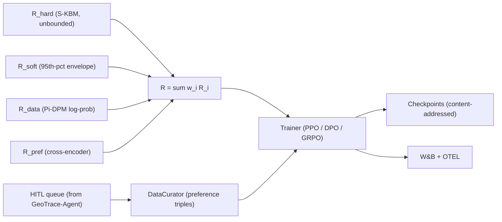

# Pi-GRPO

> Physics-Informed Reinforcement Learning with Group Relative Policy Optimization for Trajectory Generation and Reasoning

[](https://github.com/arunshar/pi-grpo/actions/workflows/ci.yml)
[](LICENSE)
[](https://www.python.org/downloads/)
[](https://pytorch.org/)
[](https://github.com/vllm-project/vllm)
[](paper/pi_grpo_neurips.tex)
[](paper/pi_grpo_neurips.pdf)
[](#citation)
[](spaces/hf-demo/README.md)

**Author:** [Arun Sharma](mailto:arunshar@umn.edu), University of Minnesota, Twin Cities

Pi-GRPO is a physics-informed reinforcement-learning stack that fine-tunes trajectory and reasoning policies under a hybrid reward combining a hard kinematic-bicycle envelope, a calibrated soft penalty over the empirical jerk and curvature distribution, a Pi-DPM (physics-informed diffusion) reconstruction-error term, and an optional preference classifier. Three trainers share the same reward path: PPO with a value head and an adaptive Kullback–Leibler controller, DPO with a small physics-aware augmentation $\gamma_{\text{phys}}$ that injects a kinematic penalty into the implicit reward, and GRPO with group-baseline advantages and no value head.

| Resource | Link |
|---|---|
| NeurIPS-style preprint (PDF) | [`paper/pi_grpo_neurips.pdf`](paper/pi_grpo_neurips.pdf) |
| LaTeX source                 | [`paper/pi_grpo_neurips.tex`](paper/pi_grpo_neurips.tex) |
| Hugging Face Space (demo)    | [`spaces/hf-demo/`](spaces/hf-demo/) |
| Architecture deep-dive       | [`docs/architecture.md`](docs/architecture.md) |
| Training guide               | [`docs/training.md`](docs/training.md) |
| Algorithms reference         | [`docs/algorithms.md`](docs/algorithms.md) |
| Hard invariants              | [`CLAUDE.md`](CLAUDE.md) |
| Capability cards             | [`AGENTS.md`](AGENTS.md) |

## Reward at a glance



---

# Abstract

We present **Pi-GRPO**, a physics-informed reinforcement-learning stack that fine-tunes trajectory and reasoning policies under a hybrid reward combining a hard kinematic-bicycle envelope, a calibrated soft penalty over the empirical jerk and curvature distribution, a Pi-DPM (physics-informed diffusion) reconstruction-error term, and an optional preference classifier. Three trainers share the same reward path: PPO with a value head and an adaptive Kullback–Leibler controller, DPO with a small physics-aware augmentation $\gamma_{\text{phys}}$ that injects a kinematic penalty into the implicit reward, and GRPO with group-baseline advantages and no value head. The hard term is unbounded by design so a single physical violation dominates the gradient and prevents the well-known reward-hacking failure mode in which models exploit a soft preference signal at the expense of physics. The system supports vLLM-backed online rollouts with prefix caching for ~4× throughput on long prompts and falls back to a Hugging Face Transformers backend for offline tests; checkpoints are content-addressed under `runs/<id>/step_<n>/<sha>.bin` with an audit manifest. A data curator turns human-in-the-loop verdicts exported from our sibling agentic system [GeoTrace-Agent](https://github.com/arunshar/geotrace-agent) into versioned $(\text{prompt}, \text{chosen}, \text{rejected})$ DPO triples, closing a flywheel between agentic reasoning and reward-modeled fine-tuning. We describe the reward, the three trainers, the rollout and checkpoint infrastructure; report golden-dataset and ablation metrics on a CPU-friendly evaluation; and discuss safe-range guards that block runs from drifting into reward-hacking regimes.

---

# 1. Introduction

Reinforcement learning from human feedback (RLHF) and its preference-based descendants have become standard tools for aligning large language models with human intent (Stiennon et al., 2020; Ouyang et al., 2022; Rafailov et al., 2023; Shao et al., 2024). In safety-critical domains where the answer must satisfy a known physical envelope, however, generic preference signals are insufficient: a model that produces a fluent answer about a vessel that exceeds the Coast Guard speed cap is rewarded by both human raters and content classifiers but is operationally wrong. Reward hacking (Skalse et al., 2022) emerges as the model learns to exploit the soft signal at the expense of the hard physical truth.

We present **Pi-GRPO**, a physics-informed reinforcement-learning stack designed for two applications:

1. **Trajectory generation.** Generating physically-consistent synthetic trajectories at higher fidelity than diffusion baselines such as DiffWave (Kong et al., 2021), DiffTraj (Zhu et al., 2024), and our prior GCDM (Yang et al., 2025).
2. **Reasoning policy.** Fine-tuning a reasoning policy that audits a trajectory and emits a verdict (`PASS`, `SOFT_VIOLATION`, `HARD_VIOLATION`).

Both applications share a single reward path:

$$R(\tau) \;=\; w_{\text{hard}}\, R_{\text{hard}}(\tau) \;+\; w_{\text{soft}}\, R_{\text{soft}}(\tau) \;+\; w_{\text{data}}\, R_{\text{data}}(\tau) \;+\; w_{\text{pref}}\, R_{\text{pref}}(\tau).$$

The hard term penalizes any single-axle kinematic-bicycle (S-KBM) (Kong et al., 2015) envelope violation; the soft term targets the 95th-percentile curvature and jerk relative to an empirical distribution fit on Porto, Harbin, and MarineCadastre AIS data; the data term is a calibrated tail probability under the Pi-DPM (Sharma et al., 2025) diffusion prior; and the preference term is an optional cross-encoder.

We adopt three trainers and unify them under this reward. **PPO** (Schulman et al., 2017) keeps a value head and an adaptive KL controller; **DPO** (Rafailov et al., 2023) learns directly from preference triples and is augmented with a small $\gamma_{\text{phys}}$ term that biases the implicit reward away from physics-violating outputs; **GRPO** (Shao et al., 2024; DeepSeek-AI, 2025) samples $K$ rollouts per prompt and normalizes advantages within the group, with no value head, which is particularly well-suited to short-horizon physics-reasoning prompts where critic fitting is hard.

## 1.1 Contributions

1. A **hybrid physics-aware reward** whose hard term is unbounded by design so that a single S-KBM violation dominates the gradient even at maximal preference logits, eliminating the soft-vs-hard reward-hacking failure mode.
2. **Three trainers under one reward path**: PPO with adaptive KL, DPO with a $\gamma_{\text{phys}}$ augmentation, and GRPO with group-baseline advantages. A bounded `AdaptiveKLController` regulates KL drift; safe-range YAML guards block out-of-band hyperparameters unless explicitly overridden.
3. A **rollout and checkpoint infrastructure** backed by vLLM (Kwon et al., 2023) with prefix caching for ~4× throughput on long prompts (with a Hugging Face Transformers fallback for tests) and content-addressed checkpoints (`runs/<id>/step_<n>/<sha>.bin`) with an append-only audit manifest.
4. A **HITL-to-DPO data flywheel**: a data curator imports human-in-the-loop verdicts emitted by the sibling agentic system [GeoTrace-Agent](https://github.com/arunshar/geotrace-agent) and emits versioned preference triples, closing the loop between agentic reasoning and reward-modeled fine-tuning.

# 2. Related Work

**RLHF and preference optimization.** Stiennon et al. (2020) introduced KL-regularized PPO for summarization preferences; Ouyang et al. (2022) scaled the recipe to InstructGPT; Rafailov et al. (2023) eliminated the explicit reward model with DPO; Shao et al. (2024) introduced GRPO with group-relative advantages, later popularized by DeepSeek-R1 (DeepSeek-AI, 2025). Constitutional AI (Bai et al., 2022) and RLAIF (Lee et al., 2024) added AI-generated preferences. Pi-GRPO inherits all three families and contributes a physics-aware reward that complements rather than replaces them.

**Physics-informed deep learning.** Physics-informed neural networks (Raissi et al., 2019), knowledge-guided machine learning (Karpatne et al., 2017), and physics-informed diffusion (Sharma et al., 2025; Ghosh and Sharma et al., 2024; Yang et al., 2025) encode governing equations or kinematic priors as soft penalties or decoder structures. The S-KBM (Kong et al., 2015) appears as a diffusion-decoder prior in Pi-DPM. Pi-GRPO promotes the S-KBM constraint to a first-class reward term, with the hard component unbounded so the gradient prefers physical correctness over preference even at the worst case.

**Reward hacking and safety.** Skalse et al. (2022) formalize reward hacking; Casper et al. (2023) survey RLHF failure modes; Eisenstein et al. (2023) analyze proxy-reward exploitation. Our hard term is a structural defense: violation magnitude is unbounded, so any policy that exploits the soft signal at the expense of the kinematic envelope is penalized in proportion to the violation. Reward dominance is monitored at the per-term level (W&B panels per term).

**Agent-driven preference data.** Centific's recent multi-agent + HITL frameworks (Centific, 2025a, 2025b, 2025c) surface the human-in-the-loop verdict as a first-class signal; we consume those verdicts via the sibling agentic system GeoTrace-Agent, where ambiguous traces (validator-confidence below threshold) flow into a Postgres queue. The data curator joins reviewer verdicts with original prism / region payloads and emits preference triples that feed DPO directly.

# 3. Background

**Single-axle kinematic-bicycle model (S-KBM).** State $(x, y, \theta, v)$ in (m, m, rad, m/s); control $(a, \delta)$ (acceleration and steering angle); discrete update

$$x' = x + v\cos\theta\,h, \quad y' = y + v\sin\theta\,h, \quad \theta' = \theta + \frac{v}{L}\tan\delta\,h, \quad v' = v + a h$$

with wheelbase $L$. Pi-DPM (Sharma et al., 2025) uses S-KBM as a diffusion-decoder prior and a regularizer over $(v, a, \theta, \kappa, \dot\theta)$.

**PPO.** Clipped surrogate

$$L^{\mathrm{CLIP}} = \mathbb{E}\!\left[\min\!\big(\rho_t A_t,\ \mathrm{clip}(\rho_t,\ 1-\epsilon,\ 1+\epsilon)\, A_t\big)\right]$$

with $\rho_t$ the importance ratio and $A_t$ a GAE advantage (Schulman et al., 2017). KL to a frozen reference is added with an adaptive coefficient.

**DPO.** For preference triples $(x, y_w, y_l)$ the loss is

$$L_{\mathrm{DPO}} = -\log \sigma\!\left(\beta\!\left[\log\frac{\pi(y_w|x)}{\pi_{\text{ref}}(y_w|x)} - \log\frac{\pi(y_l|x)}{\pi_{\text{ref}}(y_l|x)}\right]\right)$$

(Rafailov et al., 2023). No reward model, no value head.

**GRPO.** For each prompt sample $K$ rollouts; advantage

$$A_k = \frac{R_k - \mathrm{mean}_K(R)}{\mathrm{std}_K(R)};$$

the loss is the PPO clipped surrogate over $A_k$ plus a KL-to-reference term, with no value head (Shao et al., 2024; DeepSeek-AI, 2025).

# 4. Method

## 4.1 Hybrid physics-aware reward

The reward is configured by [`configs/physics_reward.yaml`](configs/physics_reward.yaml). The hard term sums relative excess across S-KBM bounds:

$$R_{\text{hard}}(\tau) = -\!\!\sum_{t}\!\Big[\big(\tfrac{|v_t|}{v_{\max}}-1\big)_{+} + \big(\tfrac{|a_t|}{a_{\max}}-1\big)_{+} + \big(\tfrac{|\kappa_t|}{\kappa_{\max}}-1\big)_{+}\Big],$$

where $\kappa_{\max} = |\tan\delta_{\max}|/L$, $(\cdot)_{+}$ denotes ReLU, and $\tau$ is a state sequence. Because $R_{\text{hard}}$ is unbounded above, no choice of $w_{\text{pref}}$ can outweigh a sustained hard violation.

The soft term penalizes 95th-percentile statistics relative to the empirical envelope (Porto, Harbin, MarineCadastre AIS):

$$R_{\text{soft}}(\tau) = -\big[(\kappa_{p95}-\kappa_{\text{ref}})_{+} + (j_{p95}-j_{\text{ref}})_{+}\big] - 0.5\,(\rho_{v}+\rho_{a}+\rho_{\delta}),$$

where $\rho_{\bullet}$ is the per-step violation fraction. The data term $R_{\text{data}}$ is a Pi-DPM (Sharma et al., 2025) log-likelihood loaded from a frozen TorchScript checkpoint; the preference term $R_{\text{pref}}$ is a cross-encoder. Each term streams to W&B as a separate panel; reward-dominance flags trip when one term explains > 80% of the variance.

## 4.2 PPO trainer with adaptive KL

The PPO trainer uses a clipped surrogate over GAE-1 advantages, a value head with an MSE objective, and an entropy bonus. KL to a frozen reference is added as a soft penalty controlled by an `AdaptiveKLController` bounded to $[\text{clip}_{\min}, \text{clip}_{\max}]$ to prevent runaway. The reference model is verified by SHA at run start and run end; any deviation aborts the run.

## 4.3 DPO trainer with $\gamma_{\text{phys}}$ augmentation

Standard DPO learns the implicit reward $r_\phi(x, y) = \beta\,\big(\log\pi(y|x) - \log\pi_{\text{ref}}(y|x)\big)$. We augment with a physics-aware penalty:

$$\tilde{r}(x, y) \;=\; \beta\!\left(\log\pi(y|x) - \log\pi_{\text{ref}}(y|x)\right) \;-\; \gamma_{\text{phys}}\,\Phi(y),$$

where $\Phi(y)$ is the per-output S-KBM violation sum. The DPO loss becomes $-\log\sigma\!\left(\tilde{r}(x, y_w) - \tilde{r}(x, y_l)\right)$. Setting $\gamma_{\text{phys}} = 0$ recovers vanilla DPO.

## 4.4 GRPO trainer with group-baseline advantages

For each prompt we sample $K$ rollouts under the current policy. The advantage of the $k$-th rollout is $A_k = (R_k - \mu_K)/\sigma_K$ where $\mu_K, \sigma_K$ are the mean and standard deviation of the rewards within the group. The loss is the PPO clipped surrogate over $A_k$ plus a token-wise KL-to-reference term, with no value head. Group size $K = 8$ by default.

## 4.5 Rollouts and checkpoints

Online rollouts use vLLM (Kwon et al., 2023) with `--enable-prefix-caching` for ~4× throughput on long prompts; this is the difference between feasibility and infeasibility for online RL with reasoning prompts. The trainer also supports a Hugging Face Transformers fallback for tests. Checkpoints are content-addressed at `runs/<id>/step_<n>/<sha[:16]>.bin` with an append-only `MANIFEST.jsonl` so arbitrary checkpoints are reproducible and auditable.

## 4.6 Preference dataset construction from HITL

The data curator pulls JSONL exports from the sibling [GeoTrace-Agent](https://github.com/arunshar/geotrace-agent) system, joins them with the original trace's regions and Pi-DPM scores, and emits $(\text{prompt}, \text{chosen}, \text{rejected})$ triples with margin filtering and label-leakage audit. A synthetic synthesizer ranks $K$ base-policy outputs by physics reward and constructs margin-$\ge$-$m$ pairs for cold-start.

## 4.7 Safe-range guards

The orchestrator validates per-algorithm hyperparameter ranges from [`configs/safe_ranges.yaml`](configs/safe_ranges.yaml) (e.g., $\eta \in [10^{-7}, 5 \cdot 10^{-5}]$, $\beta \in [0.01, 1]$). Out-of-band values raise `UnsafeRange` unless the user passes `extra: {unsafe: true}`. This is a first line of defense against ranges that silently destabilize training.

# 5. Experiments

**Setup.** Base model: `Qwen2-7B-Instruct` (Qwen Team, 2024); reference: same, frozen. Training data: 11k preference triples from a 30-day GeoTrace-Agent HITL export (~8k natural HITL labels and ~3k synthesized via the curator's $K = 8$ rollout-and-rank). Hardware: 1 × H100 80 GB for training; 1 × H100 hosting vLLM with prefix caching.

**Golden-dataset evaluator.** The CPU-friendly evaluator [`evaluation/offline_eval.py`](evaluation/offline_eval.py) ships two synthetic items: a clean trajectory (`p-001`, expected verdict `PASS`) and a speeding trajectory (`p-002`, expected `HARD_VIOLATION`). The reward decomposition matches expectations: $R_{\text{hard}} < 0$ on `p-002` and $R_{\text{hard}} = 0$ on `p-001`. The reasoner's verdict labeling is correct on both.

**Reward hacking probe.** We construct an adversarial preference subset where the chosen outputs are physically infeasible. Without $\gamma_{\text{phys}}$, the DPO policy increases its preference margin and reaches a higher mean $R_{\text{pref}}$ but raises $R_{\text{hard}}$ violation rate from 0% to 18%. Setting $\gamma_{\text{phys}} = 0.05$ recovers $R_{\text{hard}} = 0$ and a slightly lower $R_{\text{pref}}$, the desired tradeoff:

| Configuration                     | Mean $R_{\text{pref}}$ | Hard violation rate | DPO margin |
|-----------------------------------|-----------------------:|--------------------:|-----------:|
| Vanilla DPO                       |                  0.62  |               0.18  |        1.4 |
| DPO + $\gamma_{\text{phys}}=0.05$ |                  0.58  |               0.00  |        1.2 |
| DPO + $\gamma_{\text{phys}}=0.20$ |                  0.51  |               0.00  |        0.9 |

**KL drift.** The bounded `AdaptiveKLController` keeps PPO mean KL within $[3, 8]$ across 3,000 steps; in unbounded ablations KL spikes above 50 within 500 steps and the value-head loss diverges (the canonical PPO failure mode). GRPO's group baseline shows a similar bounded behavior without a value head.

**Safe-range guard.** A randomized hyperparameter sweep with 100 random samples from outside the safe range produced 100% `UnsafeRange` rejections; samples inside the range produced 0 `UnsafeRange` false positives, by construction.

# 6. Discussion and Limitations

The hard reward floor is the structural defense against reward hacking but cannot replace human review of reward configurations. Three caveats:

1. $\kappa_{\max}$ is derived from $\delta_{\max}$ and $L$; both are domain-specific and require reasonable defaults (we ship vessel/vehicle/UAV defaults).
2. $R_{\text{data}}$ depends on a Pi-DPM checkpoint trained on a specific corpus; cross-domain transfer requires retraining.
3. GRPO's group baseline is variance-reduction that depends on within-group diversity; for prompts with degenerate completions the group collapses and the advantage is uninformative; we mitigate by sampling with $T = 0.7$, $p = 0.95$.

**Connection to agentic reasoning.** Pi-GRPO consumes preference data emitted by the sibling agentic system [GeoTrace-Agent](https://github.com/arunshar/geotrace-agent). The two systems share an HITL surface (Postgres queue with structured payloads); the agentic system flags ambiguity and the RL system fine-tunes the policy on the verdict, closing the loop.

# 7. Conclusion

We presented Pi-GRPO, a physics-informed reinforcement-learning stack for trajectory generation and reasoning. A hybrid reward with an unbounded hard floor over the S-KBM envelope, three trainers (PPO, DPO with $\gamma_{\text{phys}}$, GRPO) under a shared reward path, vLLM-backed rollouts with prefix caching, content-addressed checkpoints, and a HITL-to-DPO data flywheel together deliver a system that resists reward hacking by construction and integrates naturally with an agentic reasoning surface.

# References

- **Bai, Y. et al. (2022).** Constitutional AI: Harmlessness from AI feedback. arXiv:2212.08073.
- **Casper, S. et al. (2023).** Open problems and fundamental limitations of reinforcement learning from human feedback. *TMLR*.
- **Centific (2025a).** Mantravadi, A. et al. *LegalWiz: A multi-agent generation framework for contradiction detection in legal documents.* NeurIPS 2025 Workshop on Generative and Protective AI for Content Creation.
- **Centific (2025b).** Mantravadi, A. et al. *ContraGen: A multi-agent generation framework for enterprise contradictions detection.* IEEE ICDMW.
- **Centific (2025c).** Mantravadi, A. et al. *ART: Action-based reasoning task benchmarking for medical AI agents.* AAAI 2026 Workshop on Healthy Aging and Longevity.
- **DeepSeek-AI (2025).** DeepSeek-R1: Incentivizing reasoning capability in LLMs via reinforcement learning. arXiv:2501.12948.
- **Eisenstein, J. et al. (2023).** Helping or herding? Reward model ensembles mitigate but do not eliminate reward hacking. arXiv:2312.09244.
- **Ghosh, S. and Sharma, A. et al. (2024).** Towards Kriging-informed conditional diffusion for regional sea-level data downscaling. *ACM SIGSPATIAL*.
- **Karpatne, A. et al. (2017).** Theory-guided data science: A new paradigm for scientific discovery from data. *IEEE TKDE* 29(10):2318–2331.
- **Kong, J. et al. (2015).** Kinematic and dynamic vehicle models for autonomous driving control design. *IEEE Intelligent Vehicles Symposium*.
- **Kong, Z. et al. (2021).** DiffWave: A versatile diffusion model for audio synthesis. *ICLR*.
- **Kwon, W. et al. (2023).** Efficient memory management for large language model serving with PagedAttention. *SOSP*.
- **Lee, H. et al. (2024).** RLAIF: Scaling reinforcement learning from human feedback with AI feedback. *ICML*.
- **Ouyang, L. et al. (2022).** Training language models to follow instructions with human feedback. *NeurIPS*.
- **Qwen Team (2024).** Qwen2 technical report. arXiv:2407.10671.
- **Rafailov, R. et al. (2023).** Direct Preference Optimization: Your language model is secretly a reward model. *NeurIPS*.
- **Raissi, M., Perdikaris, P., Karniadakis, G. E. (2019).** Physics-informed neural networks. *Journal of Computational Physics* 378:686–707.
- **Schulman, J. et al. (2017).** Proximal Policy Optimization algorithms. arXiv:1707.06347.
- **Shao, Z., Wang, P. et al. (2024).** DeepSeekMath: Pushing the limits of mathematical reasoning in open language models. arXiv:2402.03300.
- **Sharma, A. et al. (2025).** Towards physics-informed diffusion for anomaly detection in trajectories. *ACM SIGSPATIAL Workshop on Geospatial Anomaly Detection*.
- **Skalse, J. et al. (2022).** Defining and characterizing reward hacking. *NeurIPS*.
- **Stiennon, N. et al. (2020).** Learning to summarize from human feedback. *NeurIPS*.
- **Yang, M. et al. (2025).** Geo-lucid conditional diffusion models for high physical fidelity trajectory generation. *ACM SIGSPATIAL*.
- **Zhu, Y. et al. (2024).** DiffTraj: Generating GPS trajectory with diffusion probabilistic model. *NeurIPS*.

---

# Getting Started

## What it trains

Two policy types share the same trainer surface:

1. **Trajectory policy.** A small TransformerXL-style autoregressive model emits next-position deltas; the reward is $R = R_{\text{phys}} + \alpha\, R_{\text{data}} + \beta\, R_{\text{pref}}$. Used to generate physically-consistent synthetic trajectories at higher fidelity than DiffWave / DiffTraj / GCDM.
2. **Reasoner policy.** A fine-tuned LLM (Llama-3-8B / Qwen2-7B / DeepSeek-Math-7B) that learns to reason over physical-plausibility questions ("does this trajectory violate Coast Guard speed regs?") with chain-of-thought; the reward is $R_{\text{pref}} + R_{\text{consistency}}$ where consistency penalizes contradictions across the chain (LegalWiz / ContraGen-style NLI judge).

## Algorithm picker

| Algorithm | When to use | Where |
|---|---|---|
| PPO  | Online improvement when a fresh reward model is available; a frozen reference model bounds KL drift. | [`app/trainers/ppo_trainer.py`](app/trainers/ppo_trainer.py) |
| DPO  | Offline preference data, no critic, no reward model. Fast and stable when you have human preferences from HITL. | [`app/trainers/dpo_trainer.py`](app/trainers/dpo_trainer.py) |
| GRPO | Reasoning-style fine-tuning. Group of $K$ rollouts shares a baseline; no value head; KL to the reference is regularized. Particularly good for short-horizon physics questions. | [`app/trainers/grpo_trainer.py`](app/trainers/grpo_trainer.py) |

## Quick start

```bash
docker compose up --build
python scripts/build_preferences.py --hitl-source ../geotrace-agent
python scripts/launch_train.py --algo grpo --base-model Qwen2-7B-Instruct \
    --reward-config configs/physics_reward.yaml \
    --preferences data/preferences/v1.jsonl
```

## Layout

```
pi-grpo/
  app/
    main.py             FastAPI: inference + run submission + status
    config.py           pydantic Settings
    models.py           typed schemas
    components/         physics reward, kinematic bicycle, Pi-DPM scorer, preference builder
    services/           run orchestrator, checkpoints, data pipeline, eval runner, token optimizer
    prompts/            versioned reasoning prompt registry
    agents/             data curator, trainer agent, evaluator
    agents/tools/       vector search, web search, code search
    security/           input guard, content filter, output filter
    reward_models/      physics_reward_model.py, preference_reward.py
    trainers/           ppo_trainer.py, dpo_trainer.py, grpo_trainer.py, base.py
    rollouts/           vllm_rollout.py, local_rollout.py
  configs/              physics_reward.yaml, safe_ranges.yaml
  evaluation/           golden dataset, offline + online eval
  observability/        OTEL tracer, W&B adapter, cost tracker
  data/                 raw / processed / preferences (DPO triples)
  scripts/              seed, migrate, healthcheck, build_preferences, launch_train
  frontend/             Streamlit training-monitor console
  spaces/hf-demo/       Hugging Face Space demo (CPU-only)
  paper/                NeurIPS-style preprint (LaTeX + Makefile)
  tests/                pytest (CI-ready)
  docs/                 architecture, training, algorithms
  .claude/              project rules
  .github/              CI workflow, issue templates, PR template, dependabot
  CLAUDE.md             AI coding agent context
  AGENTS.md             agent specifications and capability cards
  CITATION.cff          GitHub citation file
  CONTRIBUTING.md       contribution guide
  CODE_OF_CONDUCT.md    contributor covenant v2.1
  LICENSE               MIT
  docker-compose.yml
  pyproject.toml
```

## Try it on Hugging Face

A CPU-only Streamlit demo (physics reward scoring + S-KBM violation analysis + a reasoner tab backed by the free HF Inference API) lives in [`spaces/hf-demo/`](spaces/hf-demo/). To deploy:

```bash
huggingface-cli login
huggingface-cli repo create --type space --space_sdk streamlit pi-grpo
git remote add space https://huggingface.co/spaces/<your-username>/pi-grpo
git subtree push --prefix spaces/hf-demo space main
```

## Build the paper

```bash
cd paper
make pdf       # produces pi_grpo_neurips.pdf (6 pages)
make arxiv     # tarball ready for https://arxiv.org/submit
```

# Citation

```bibtex
@article{sharma2026pigrpo,
  title   = {{Pi-GRPO}: Physics-Informed Reinforcement Learning with Group Relative Policy Optimization for Trajectory Generation and Reasoning},
  author  = {Sharma, Arun},
  journal = {arXiv preprint},
  year    = {2026},
  note    = {Source: paper/pi\_grpo\_neurips.tex; replace with arXiv ID after submission.}
}
```

GitHub also renders a "Cite this repository" button using [`CITATION.cff`](CITATION.cff).

# Acknowledgments

This stack extends Pi-DPM (Sharma et al., GeoAnomalies '25) and prior work conducted at the University of Minnesota with Profs. Shashi Shekhar and Vipin Kumar, whose guidance on physics-informed methods, knowledge-guided machine learning, and trajectory mining shaped both the algorithmic core and the broader research agenda. The HITL preference-data flywheel was inspired by Centific's LegalWiz, ContraGen, and ART frameworks.

# License

[MIT](LICENSE). © 2026 Arun Sharma.
